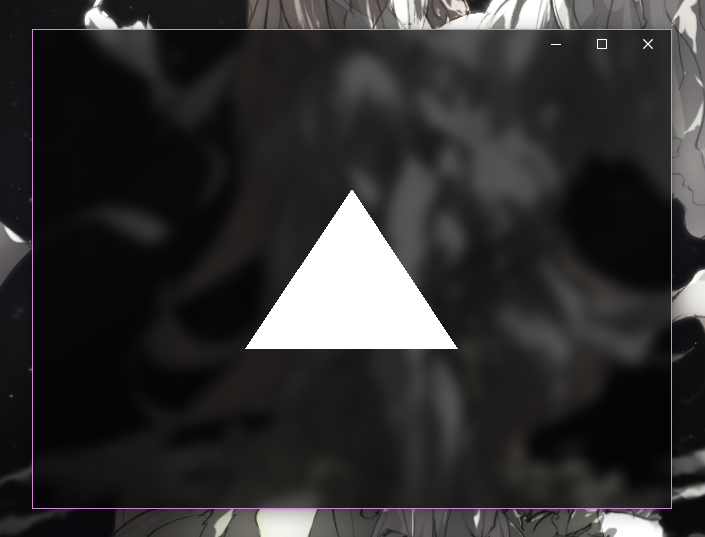

# Stylish OpenGL

## What's this?

This is a sample that shows how to make a beautiful custom window on Windows 10 and also have OpenGL render into it. The goal was to make the window look as UWP-like as possible and (a couple undocumented APIs later) I'd say it turned out alright (it's also possible to turn on the acrylic blur by changing the ACCENTPOLICY struct state to 4). However, there are still some flaws like flickering with the blur turned on. It's also not possible to resize the window outside its border because we replace the native invisible frame entirely and thus hit-testing outside the client area is not possible.

*Tested on Windows 10 1903 and 2004*